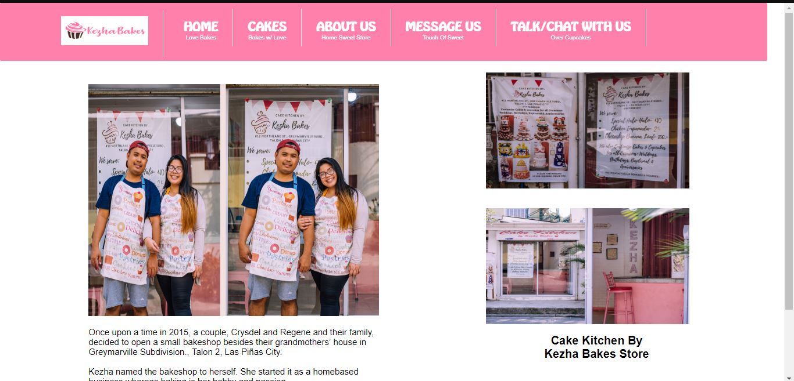

## Bakery Website with Email and Chat Bot

This is a system that promotes a Bakery located in Paranaque Metro Manila, Philippines

## :bulb: Feature/s

- :cake: Viewing of Products . Categories in Birthday Cakes, Wedding Cakes, Occational Cupcake etc.
- :email: Can send email for inquiries and ordering of products.
- :robot: Also have a Chat Bot
- :key: Admin:  _Can upload/edit/delete photos and description_ & _View Costumers Email and Registration_

## :computer: Programming Languages used:
### 🖥 Frontend 
This is all pure HTML / CSS & PHP

&nbsp;
&nbsp;

### 💾 Backend
MySQL for the database

## :coffee: System Overview

    
Home Page

    

    
Cakes Page

    

    
About Us Page

    

    
Contact Page

    

    
ChatBot Page

    

#### :key: _Admin_

    
Admin Login Page

    

    
Product Page

    
    
    

    
Costumer Page

    
    

